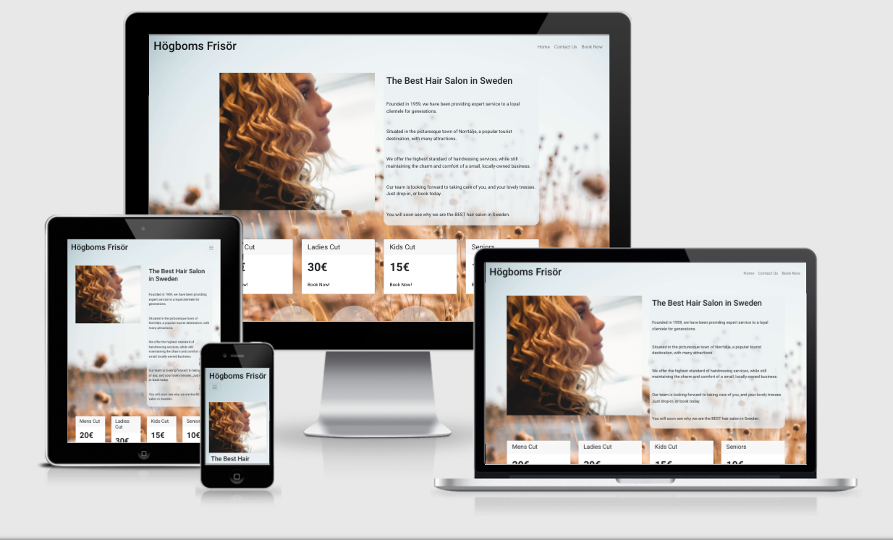

# H1 HÖGBOMS FRISÖR - The Best Hair Salon in Sweden
### This is the official website for "Högboms Frisör - The Best Hair Salon in Sweden." This is the world-famous Scandinavian hair salon based in the small town of Norrtälje, just outside of Stockholm - a popular international tourist destination.
### This website is designed to be both useful, as well as inviting to potential clients of the hair salon, where they can easily find basic information such as prices for different cuts, opening hours, contact information and social media links, as well as book appointments.

## Features
### Header and Navigation
- Featured at the top of page, the navigation shows the name of the hair salon in the top left corner: HÖGBOMS FRISÖR that links to the top of the Home page.
- The other internal navigation links are to the right. Home, Contact Us, and Book Now which link to the respective three separate pages.
- The navigation is easy to find, clearly tells the user the name of the website, and is in a color and font that contrasts with the background.

### About Us Section
- Gives information about the hair salon, as well as presenting to the user the company ethos.
- Provides a welcoming impression to the user.
- Informs the consumer that they both have the option to drop-in, or to book an appointment on the website.

### Prices Section
- Gives a brief and clear overview of the different cuts available for different demographics, as well as the price.
- Provides a clickable link under each cut/price option that takes the user straight to the booking page, where they have the option of booking an appointment.
- Is accompanied by an decorative image, showing the salon.

### Contact Us Section
- Provides answers to common questions by the consumer/user, such as: Address, phone number, email.
- Clearly displays the opening hours of the hair salon.
- Has a friendly header, which invites the user to come and visit the salon in person.

### Booking Section
- Gives the user the option of booking an appointment on the website, by filling out a simple form.
- Is accompanied by an decorative image, showing the salon.

### Footer
- Format and style is consistent over all three pages of the website.
- Provides easy, and clear access to links to all four major social media platforms: Facebook, Twitter, Youtube, Instagram

# Testing
- I tested that this page works in different browsers: Chrome, Firefox, Safari.
- I confirmed that the project is responsive, looks good and functions on all standard screen sizes using the devtools device toolbar.
- I confirmed that the navigation, header, about us, contact us, and book now text are all readable and easy to understand.
- I have confirmed that the form works: requires entries in every field, will only accept en email in the email field, and the submit button works.

## Bugs
### Resolved bugs
When testing my website, I discovered my attempt at enclosing an anchor tag in a button element caused an error. I fixed this, and the issue was resolved.

## Validator Testing
- HTML: After resolving my bug mentioned above, no errors were returned when passing through the official W3C validator.
- CSS: Since a bootstrap template was used for the website, some warning messages were returned when passing through the official Jigsaw validator. However, I checked them, and all the "warnings" returned were intrinsic parts of the bootstrap template itself. So I concluded that the warnings had to do with the validatior encountering errors when processing the css of a bootstrap template.
- Accessibility: Ran Lighthouse in devtools to check Accessibility, and got an Accessibility score of 98.

# Deployment
- The site was deployed to GitHub pages.
- The live link can be found here: https://stephaniejfogelvik.github.io/CI_Project_1/

# Credits
- A rough draft start of the code used for my final version of my project was written by my mentor, although based on what I had already written (which he was teaching me how to change in order to instead format it with an bootstrap template.) I credit my mentor Felipe Souza Alarcon for helping me write part of this code. I have cited within comments where it starts and ends from where I first entered it onto the page. I did frequent commits to show how it changed from there, and the additional pages were added.
- I decided to change strategy and delete my work, in favor of using a bootstrap template instead, to finish my website. This was a recommendation by my mentor, after a session where he showed me clearly his thinking behind this, which I quickly came into agreement with. My original efforts can still be seen in the git commit history.
- Credit also goes to the good people over at https://stackpath.bootstrapcdn.com/bootstrap/4.5.0/css/bootstrap.css, for the original bootstrap template code used.

# Media
- The social media icons used in the footer were taken from Font Awesome.

